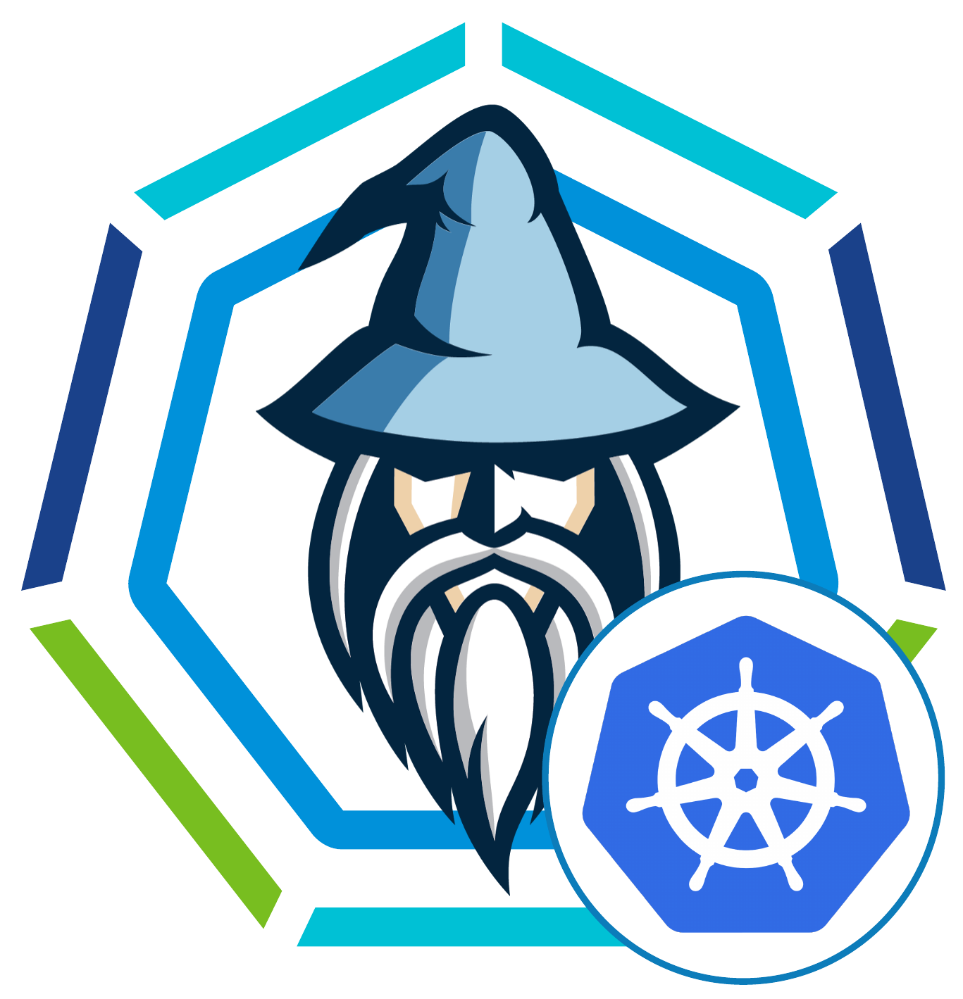

# Merlin's TKG wizard



A wizard like UI (GUI on roadmap) for Tanzu Kubernetes Grid. 

The goal is to:
- An installer experience to install TKG management cluster (encapsulates all dependencies and filesystem within a container). 
- **TKG TKC UI**: Provides an UI deploying TKG workload cluster.

***Good solution for private cluster with bastion host***

# Kick start:

## Pre-Req:

### Git-clone
- Git clone this repo
- CD into the directory.
- Follow along as per below.

### Docker
- local machine / server must have docker ce or docker ee installed. (eg: `docker version`)
- May need to run this (if you have not done this before) `sudo usermod -aG docker $USER`

### Binaries

***eg: 1.5.1. You must download the linux version regardless of your host OS as the merlin contaier is linux based.***

- Download tanzu cli ENT from https://customerconnect.vmware.com/en/downloads/info/slug/infrastructure_operations_management/vmware_tanzu_kubernetes_grid/1_x and place it in binaries directory.

OR

- Download TCE (Tanzu community edition) cli https://tanzucommunityedition.io/download/ and place it in binaries directory.


## Environment variable

- rename .env.sample to .env (`cp .env.sample .env`)
- Fill out values in the .env file accordingly using your favorite editor (eg: `nano .env`). Example:
    - `CLOUD`=vsphere or aws or azure. *MANDATORY*
    - `BASTION_HOST`=keep and provide ip or fqdn of the VM if using jump or bastion host. Otherwise delete this variable. | *OPTIONAL if not using bastion host* | ***must provide the file named id_rsa as the privatekey under dir .ssh to access bastion host. password based login not supported.***
    - `BASTION_USERNAME`=keep and provide username for the jump or bastion host. Otherwise delete this variable. | **OPTIONAL if cloud is not aws* if not using bastion host*
    - `DOCKERHUB_USERNAME`=dockerhub username. | *MANDATORY, needed to avoid dockerhub ratelimit issue*
    - `DOCKERHUB_PASSWORD`=dockerhub password. | *MANDATORY*
    - `TKG_ADMIN_EMAIL`=an email addess. does not have to a real email address. This email gets used for creating key-pair needed to deploying management cluster. | *MANDATORY*
    - `BIND_ADDRESS`=the ip address or fqdn and port number where the TKG installer UI will be accessible. | *OPTIONAL if you are not using a bastion host or you have a browser available on bastion host. Default is: 127.0.0.1 is 127.0.0.1 is not available on port 8080 provide this value. If this is run in bastion host the use the up address of the bastion host. eg: 192.168.110.100:8080*
    - `AWS_ACCESS_KEY_ID`=if not aws delete this line. | *OPTIONAL if cloud is not aws*
    - `AWS_SECRET_ACCESS_KEY`=if not aws delete this line. | *OPTIONAL if cloud is not aws*
    - `AWS_SESSION_TOKEN`=if not aws delete this line. | *OPTIONAL if cloud is not aws*
    - `AWS_REGION`=if not aws delete this line. | *OPTIONAL if cloud is not aws*
    - `AZ_BASE_IMAGE`=if not azure delete this line. Otherwise grab the latest value from https://docs.vmware.com/en/VMware-Tanzu-Kubernetes-Grid/{tkg_version}/vmware-tanzu-kubernetes-grid-{tkg_version_without_any_dot}/GUID-mgmt-clusters-azure.html#accept-the-base-image-license-5 . | *OPTIONAL if cloud is not azure*


## Start

- open a command prompt

#### "start" in linux/mac** 
```
chmod +x start.sh
./start.sh
```

#### "start" in windows** 
(windows is always special :) )
```
./start.bat
```


## Usage

- `merlin --help`
- `tanzu --help`
- `kubectl version`


# Demo video
*play in 1.75x speed*

[](https://youtu.be/8TfGa6OWwS8)


# Under the hood

### Start.sh/bat
This script is very simple.
- It checks whether there's a image with container name exists, if not it creates a new image
- AND starts a container with same name using the image.
- When using it first time it will create image and run container using the image
- When using it 2nd times and so on, it will not create image again rather will use the created image previously to run the container.

** Optionally you can pass 2 parameters: eg: `./start.sh merlin-tkg forcebuild`
- param #1: the name of the image/container. If not passes the default name assumed is: merlin-tkg. eg: `./start.sh my-custom-tkg-wizard`. Must be param #1
- param #2: pass a param `forcebuild` to rebuild the image. Can be param #1 (in the absense of name) or param #2 (when you are supplying a custom name for whatever reason)

### the container
The container is the engine of this wizard.
- It encapsulates all the necessary dependencies like `carvel tools`, `tanzu cli`, `kubectl` etc.
- It does not conflict with local environment. Perfect for keeping cluster based TKG isolated.
- Contains easy start for TKGm management cluster deployment
- Contains UI for deploying TKG workload cluster. run `tkgui --help`
- When your cluster is private and only accessible through a bastion/jump host this wizard automatically creates an interface with the bastion host and communicated to perform actions though the bastion host via tunnel. This is a great to interact with private cluster through bastion host.


# Other stuffs

### KB: AVI latest version issue with tkgm
https://kb.vmware.com/s/article/87640
kubectl patch pkgi ako-operator -n tkg-system --type "json" -p '[{"op":"replace","path":"/spec/paused","value":true}]'
kubectl set env deployment/ako-operator-controller-manager avi_controller_version="21.1.3" -n tkg-system-networking
AKOoperatorPod=kubectl get pod -n tkg-system-networking -o json | jq -r '.items[] | select(.metadata.name | startswith("ako-operator-controller-manager-")) | .metadata.name'
kubectl delete pod $AKOoperatorPod -n tkg-system-networking
unset AKOoperatorPod

